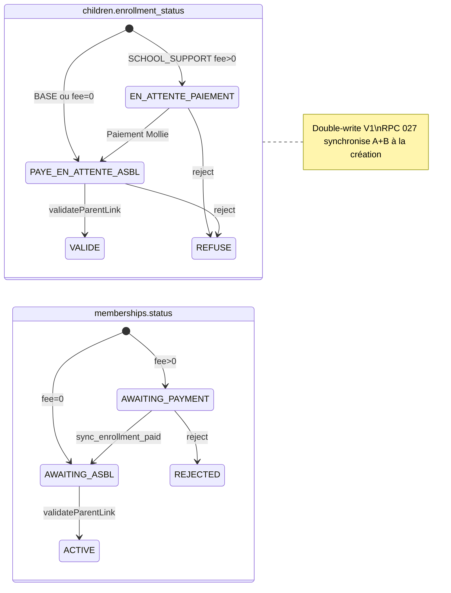
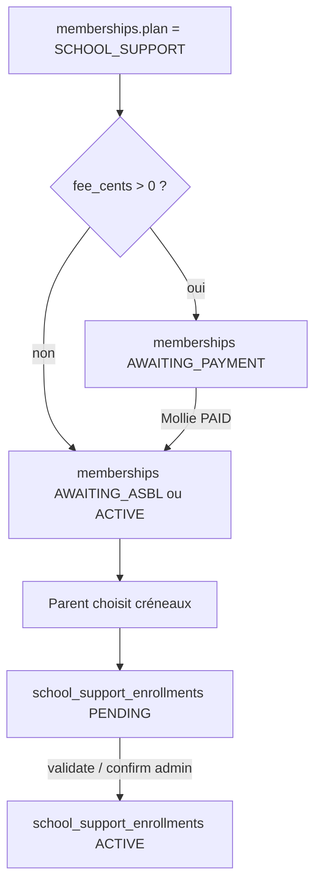

# Matrice des statuts d'inscription — AsblOS

> **C1 — Phase 0** (doc officielle, juin 2026)  
> Objectif : une seule référence pour savoir **quel champ fait foi**, **quand**, et **comment les trois modèles coexistent**.

Constantes TypeScript : `lib/constants/status.ts`  
Enums Postgres : `types/database.ts` → `Enums`

---

## 1. Résumé exécutif

AsblOS utilise **trois couches de statut** pour le parcours enfant / adhésion / soutien scolaire :

| Couche | Table / colonne | Rôle métier |
|--------|-----------------|-------------|
| **A — Legacy enfant** | `children.enrollment_status` | Statut global enfant (Module 3, pré-014) — encore lu/écrit partout |
| **B — Adhésion annuelle** | `memberships.status` + `plan` + `fee_cents` | **Source de vérité cible** pour cotisation et validation ASBL (migration 014+) |
| **C — Programme soutien** | `school_support_enrollments.status` | Inscription aux **jours / créneaux** d'un programme (Module 4) — indépendant de A/B |

**État V1 (aujourd'hui)** : B est prioritaire pour paiement et admin **si** une ligne `memberships` existe ; sinon A sert de fallback (`inferMembership`, `isLegacyPending`, dashboard parent `serenity.ts`).

**État V2 (objectif)** : B seul pour cotisation/validation ; A en lecture seule puis suppression ; C inchangé.

---

## 2. Qui fait foi ? (règles de lecture)

| Contexte | Champ autoritaire | Fallback si absent |
|----------|-------------------|---------------------|
| Paiement en ligne parent | `memberships.status` + `fee_cents` | `children.enrollment_status === EN_ATTENTE_PAIEMENT` |
| Blocage validation admin (`validateParentLinkAction`) | `memberships` (AWAITING_PAYMENT + fee > 0) | `enrollment_status === EN_ATTENTE_PAIEMENT` si `created_via = PARENT` |
| Confirmation soutien admin (`confirmSchoolSupportMembershipAction`) | `memberships.plan/status` | `enrollment_status === PAYE_EN_ATTENTE_ASBL` (`isLegacyPending`) |
| Dashboard parent (étapes sérénité) | `memberships` en priorité | `link.enrollment_status` (legacy) |
| Éligibilité choix créneaux parent | `memberships` | trigger **038** si lien validé sans ligne B |
| Affichage liste admin / paiements | `memberships` | sync + mapping depuis A |
| Inscription programme (jours) | `school_support_enrollments.status` | — (nécessite adhésion SCHOOL_SUPPORT côté B) |

**Règle d'or pour tout nouveau code :**

1. Lire **`memberships`** en premier (année courante via `getCurrentSchoolYear()`).
2. N'écrire **`children.enrollment_status`** que si une action existante le fait déjà en parallèle (double-write V1).
3. Ne jamais déduire la cotisation uniquement depuis A si B existe.

---

## 3. Couche A — `children.enrollment_status`

Enum SQL : `child_enrollment_status`

| Valeur | Label métier | Signification |
|--------|--------------|---------------|
| `BROUILLON` | Brouillon | Enfant créé staff, inscription non finalisée |
| `EN_ATTENTE_PAIEMENT` | Cotisation due | Soutien payant — paiement non reçu |
| `PAYE_EN_ATTENTE_ASBL` | Payé, attente ASBL | Cotisation OK (ou gratuite) — validation ASBL pending |
| `VALIDE` | Membre actif | Enfant validé par l'ASBL |
| `REFUSE` | Refusé | Dossier refusé |

**Écriture typique :**

- RPC `create_parent_enrollment_core` (027) — calcule statut depuis plan + tarif
- `validateParentLinkAction` → `VALIDE`
- `rejectParentLinkAction` → `REFUSE`
- `sync_enrollment_paid` (webhook Mollie) → `PAYE_EN_ATTENTE_ASBL`
- Staff création enfant → `VALIDE` ou `EN_ATTENTE_PAIEMENT`
- Rollback staff → `BROUILLON`

---

## 4. Couche B — `memberships`

Enum SQL : `membership_status` · Plan : `membership_plan` (`BASE` | `SCHOOL_SUPPORT`)

| status | Label métier | Signification |
|--------|--------------|---------------|
| `AWAITING_PAYMENT` | Paiement dû | `fee_cents > 0` et pas encore payé |
| `AWAITING_ASBL` | Attente validation | Payé ou gratuit — ASBL doit valider |
| `ACTIVE` | Adhésion active | Année en cours validée |
| `REJECTED` | Refusée | Refus admin |
| `CANCELLED` | Annulée | Annulation |

**Cas `AWAITING_PAYMENT` + `fee_cents = 0` :** pas de blocage paiement (traité comme « pas de paiement en ligne ») — voir tests `school-support-eligibility.test.ts`.

### Mapping A ↔ B (référence migration 014)

| `children.enrollment_status` | `memberships.status` | Notes |
|------------------------------|----------------------|-------|
| `EN_ATTENTE_PAIEMENT` | `AWAITING_PAYMENT` | Plan SCHOOL_SUPPORT, fee > 0 |
| `PAYE_EN_ATTENTE_ASBL` | `AWAITING_ASBL` | Après paiement ou si gratuit |
| `VALIDE` | `ACTIVE` | `asbl_validated_at` renseigné |
| `REFUSE` | `REJECTED` | |
| (autre / NULL) | `AWAITING_ASBL` | Défaut inferMembership |

**Écriture atomique préférée :**

- RPC `create_parent_enrollment_core` (027) — crée enfant + lien + membership en une transaction
- RPC `sync_enrollment_paid` — après paiement Mollie confirmé
- `validateParentLinkAction` / `confirmSchoolSupportMembershipAction` — double-write A + B
- `applySchoolSupportUpgrade` — upgrade BASE → SCHOOL_SUPPORT

**Pansement runtime (supprimé — I5 ✅) :**

- ~~`syncMissingMembershipsForCurrentParent()`~~ — remplacé par trigger DB `trg_ensure_membership_on_parent_link` (migration **038**) à la validation du lien parent.

---

## 5. Couche C — `school_support_enrollments.status`

Enum SQL : `school_support_enrollment_status`

| Valeur | Signification |
|--------|---------------|
| `PENDING` | Jours choisis (parent ou staff) — programme pas encore validé ASBL |
| `ACTIVE` | Planning validé — enfant inscrit au programme |
| `CANCELLED` | Inscription annulée |

**Indépendance :** un enfant peut avoir `memberships.status = ACTIVE` et `school_support_enrollments.status = PENDING` (jours enregistrés, ASBL pas encore confirmé).

**Activation :** `activatePendingSchoolSupportEnrollments()` — `PENDING` → `ACTIVE` lors de la validation admin enfant ou confirmation soutien.

**Prérequis métier :** `memberships.plan = SCHOOL_SUPPORT` (et cotisation OK si fee > 0).

---

## 6. Diagramme — parcours parent (inscription)

---

## 7. Diagramme — soutien scolaire (jours)

---

## 8. Points de réconciliation dans le code

| Fichier | Rôle |
|---------|------|
| `lib/enrollment/get-child-enrollment-state.ts` | **Lecture RPC** A+B+C + flags dérivés (C1 phase 1) |
| `lib/enrollment/child-enrollment-state.ts` | Parse JSON + helpers purs |
| `lib/parent/serenity.ts` | UI parent — lit **RPC** via `getChildEnrollmentStates` |
| `lib/actions/school-support-admin.ts` | ✅ RPC C1 phase 1 |
| `lib/actions/parent-admin.ts` | ✅ RPC C1 phase 1 |
| `lib/payments/sync-enrollment-paid.ts` | RPC puis fallback manuel A+B |
| `lib/membership/apply-school-support-upgrade.ts` | Met à jour A + B ensemble |

---

## 9. RPC Postgres (source de vérité serveur)

| RPC | Effet sur A / B / C |
|-----|---------------------|
| `get_child_enrollment_state` | **Lecture** A + B + C + flags dérivés (040, C1 phase 1) |
| `create_parent_enrollment_core` | Crée enfant (A), membership (B) — statuts calculés serveur (027) |
| `sync_enrollment_paid` | A → PAYE… ; B → AWAITING_ASBL (service_role, paiement PAID requis) |
| `request_school_support_upgrade` | Upgrade plan B (parent) |

**Migrations clés :** 010, 014, 018 (backfill), 026 (atomic parent), 027 (hardening), 030 (fix sync)

---

## 10. Matrice actions admin / parent

| Action | Met à jour A | Met à jour B | Met à jour C |
|--------|:------------:|:------------:|:------------:|
| Inscription parent (RPC 027) | ✅ | ✅ | (optionnel créneaux) |
| Paiement Mollie | ✅ | ✅ | — |
| `validateParentLinkAction` | ✅ VALIDE | ✅ ACTIVE | ✅ PENDING→ACTIVE |
| `rejectParentLinkAction` | ✅ REFUSE | ✅ REJECTED | — |
| `confirmSchoolSupportMembershipAction` | ✅ VALIDE | ✅ ACTIVE | ✅ PENDING→ACTIVE |
| Staff enroll soutien | ✅ | ✅ | ✅ ACTIVE direct |
| Parent choisit créneaux | — | — | ✅ PENDING |

---

## 11. Dettes connues (ne pas aggraver)

1. **Double modèle A + B** — chaque feature « inscription » doit toucher les deux ou une RPC.
2. **`isLegacyPending`** — enfants sans ligne `memberships` mais A = PAYE_EN_ATTENTE_ASBL.
3. ~~**`syncMissingMembershipsForCurrentParent`**~~ — résolu migration 038 (trigger lien validé).
4. **`allowed: true` jamais atteint** dans `resolveSchoolSupportEnrollmentEligibility` pour ACTIVE — flux toujours via `choose_days`.
5. **Noms legacy** — `serenity.ts` = dashboard parent (renommage prévu DM-4).

---

## 12. Plan V2 (C1 phases suivantes)

| Phase | Livrable |
|-------|----------|
| **0** ✅ | Ce document |
| **1** ✅ | RPC `get_child_enrollment_state(child_id, school_year)` — lecture unique (`lib/enrollment/child-enrollment-state.ts`) |
| **2** | 🔄 Lectures migrées (serenity, paiement, admin, overview, activités, file soutien) ; writers encore en double-write A+B |
| **3** | Migration drop `children.enrollment_status` ou colonne deprecated |

**Critère de fin V2 :** zéro lecture métier de `enrollment_status` hors migration/backfill ; zéro `syncMissing*` runtime.

---

## 13. Checklist nouveau développement

- [ ] Quelle couche je modifie (A, B, C) ?
- [ ] Si cotisation / validation → **`memberships`** + année scolaire
- [ ] Si jours soutien → **`school_support_enrollments`**
- [ ] Double-write A+B encore requis en V1 ?
- [ ] RPC existante applicable (`create_parent_enrollment_core`, `sync_enrollment_paid`) ?
- [ ] Test Vitest sur la règle métier (`lib/asbl/fee-utils.test.ts`, `school-support-eligibility.test.ts`)
- [ ] Pas de nouveau `infer*` / `sync*` sans ticket I5/C1

---

*Maintenu avec le code sur `main`. Dernière révision : 2026-06-11.*
